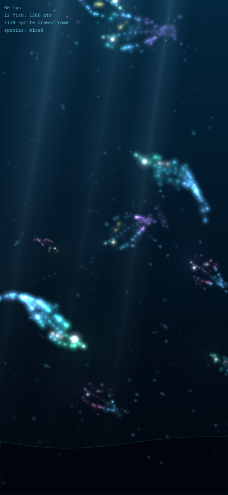
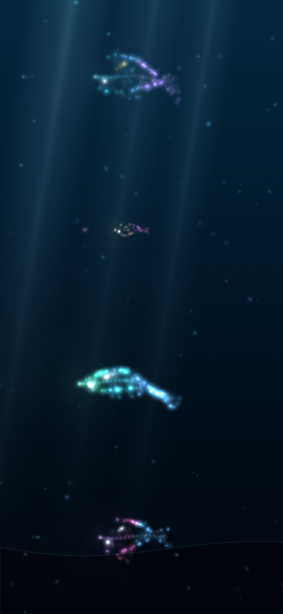
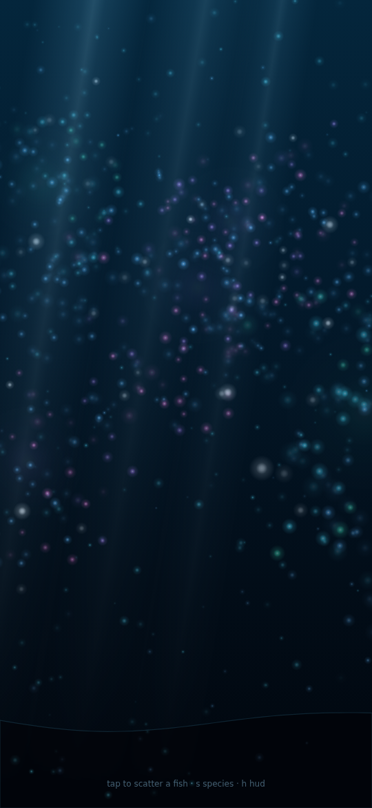

# 3D aquarium — particle fish, and asset acquisition

## The prototype

[`prototype.html`](prototype.html) is a working answer to "can the fish be
particles instead of models?". Open it in a browser — one self-contained file,
no build step, no dependencies, **and no assets at all**.



A fish here is a few dozen points sampled from a parametric side profile, bent
by a travelling wave and drawn as additive sprites. There is no mesh and no
rig, so there is nothing to license — the constraint that shapes
[docs/AQUARIUM-ASSETS.md](../docs/AQUARIUM-ASSETS.md) simply does not apply to
a fish that is generated on the device.

```bash
open aquarium/prototype.html                       # or serve the folder
open 'aquarium/prototype.html?pose=1&fish=4'       # look-dev: hold them still
npm run aquarium:shot                              # re-render docs/screenshots
npm run aquarium:clip                              # 12s mp4 into renders/
```

Flags: `fish`, `points`, `motes`, `seed`, `speed`, `hud`, `pose`. `pose=1`
parks one of each species in a column so proportion and fin shape can be judged
without waiting for a fish to swim past — the same reason `--static` exists in
`blender/liquid_shaker.py`.



### How they swim

Each fish picks a point in the tank, swims to it, and picks another. Three
things turn that from sliding into swimming:

- **Yaw is a signed scale, not a rotation.** A fish turning around rotates
  through edge-on, so `facing` animates between -1 and 1 and the body
  foreshortens on the way through. The first version rotated by 180 instead,
  which swam every leftward fish upside down — dorsal fin underneath.
- **Speed is in body lengths per second, not pixels.** `swim: [0.85, 1.20]`
  and `stride` (body lengths per tail beat, which sets the beat rate) are the
  units the animal is described in, so resizing a fish rescales its swimming
  and its beat automatically. Pixels per second is what this had first, and
  enlarging the fish left the speeds behind: the big species ended up at
  0.1–0.2 BL/s, beating hard and going nowhere — swimming in place. A cruising
  fish does roughly 0.5–2.
- **Burst and coast.** Fish flick their tails and glide rather than travelling
  at a constant rate, and the tail beat follows effort, so a coasting fish
  beats slowly and a dashing one beats hard. A constant beat is most of what
  read as sliding.
- **Personal space.** A light shove between neighbours; overlapping bodies read
  as one confused blob rather than as a school. The flow field's pull on fish
  was also cut by half, because `flowX` depends only on depth and was sliding
  the whole school the same way at once.

`swim` is the rate through the fish's own water; what it covers on screen comes
out about a third lower, deliberately — distant fish are scaled down by depth,
and a fish slows through a turn because there is little to push against
edge-on. Measured across the four species that is 0.46–1.22 BL/s, or five to
eight seconds to cross a 540px frame.

The simulation draws on a seeded generator rather than `Math.random`, so with
the clock hook driving a fixed timestep a recording reproduces frame for frame.
`window.__aquarium.fish` exposes the school, so those numbers can be measured
rather than asserted:

```js
// per fish, over a fixed-step run — key by identity, the school is
// re-sorted by depth every frame
for (const f of window.__aquarium.fish) travelled.get(f)  // ... / f.len
```

### What it settled

- **Point count has to follow fish size, not be a constant.** A flat 80 points
  spread across a hero-sized body reads as a scatter of orbs, not an animal.
  `points` is now a budget for a reference length and scales from there.
- **An outline alone reads as a ring.** Sampling only the silhouette made the
  tall species look like jellyfish. A bright lateral line down the body — a
  tenth of the budget — states which end is the head before the eye is even
  legible.
- **One bright eye is worth twenty body points.** It is the strongest "this is
  an animal" cue in the cloud.
- **Light shafts have to be sprites, not polygons.** A polygon edge stays
  visible however low you push the alpha; the first draft read as hard stripes.

### What it costs

At the default 12 fish the HUD (`?hud=1`) reports **~1,270 points and ~1,150
sprite draws per frame** — in the same range as the shaker's existing ~950
particles, which is the budget this was designed against. The frame rate in
that HUD comes from headless Chromium on a desktop container, so treat it as
confirmation that the *draw count* is what was predicted, **not** as a phone
measurement. Only the APK on a handset settles that.

### Seeing it move

Stills cannot show the thing this exists to prove. `npm run aquarium:clip`
records an mp4 into `renders/` (gitignored, like the Blender output), driving
the page on a fixed timestep through `window.__aquarium.now` rather than
recording in real time — capture is much slower than playback, and the clip
comes out smooth and identical on every run regardless. `CLIP_SECONDS`,
`CLIP_FPS`, `CLIP_BURST` and `CLIP_BURST_ALL` tune it.

That clock hook is not only for capture: under a `WallpaperService` the WebView
has no vsync of its own and the host has to drive the frame, which is the same
arrangement the shaker makes through `window.__shaker`.

It needs a system ffmpeg. The one Playwright bundles is a WebM-only build with
no H.264 encoder, so `apt-get install ffmpeg` is a prerequisite for mp4.

### What a bought mesh cannot do

Tapping a fish bursts it into points that the water carries off before they
reassemble — that is the tap in the clip at about seven seconds. The fish live
in the same flow field as the motes, so this is a few lines rather than a
feature.



## Asset acquisition

Where each remaining piece comes from, what it is licensed under, and a check
that refuses licences our delivery format cannot honour. The sourcing research
and the reasoning behind the policy are in
[`docs/AQUARIUM-ASSETS.md`](../docs/AQUARIUM-ASSETS.md). The prototype above
removes the fish from this list; coral, materials and lighting still need it.

Short version: a live wallpaper ships as an APK, an APK is a zip, and a loose
`.glb` inside one is retrieved by renaming the file. Marketplace royalty-free
licences forbid exactly that, so v1 is sourced entirely from public-domain and
procedural assets — Quaternius for rigged animated fish, Smithsonian scans for
coral, ambientCG and Poly Haven for materials and light, and this project's own
Blender pipeline for the tank, water, plants and caustics.

## Acquiring

Downloaded assets are deliberately **not committed** — they are large, they are
re-acquirable from the manifest, and keeping them out means a paid asset can
never be pushed to a public repo by accident.

```bash
node scripts/aquarium-assets.mjs check     # what is missing, and what its licence permits
# download each listed source into aquarium/assets/<path from the manifest>
node scripts/aquarium-assets.mjs lock      # SHA-256 every acquired file
node scripts/aquarium-assets.mjs attrib    # regenerate THIRD-PARTY-LICENSES.md
```

`check` exits non-zero on a licence violation, an unrecognised licence, or a
manifest entry missing its source — so it belongs in CI ahead of any APK build.
`lock` reports files that changed or disappeared since the last run, which is
how a silently swapped mesh gets noticed.

## Adding an asset

Add an entry to [`assets.manifest.json`](assets.manifest.json) with its `id`,
`role`, `title`, `author`, `license`, source `page` and expected `files`, then
run `check`. An unfamiliar licence string returns `review` rather than passing;
that is the point. Encode a new one in `scripts/aquarium-assets.mjs` only after
reading the actual terms.

## Shipping paid assets later

Set `"distribution": "packed"` in the manifest once meshes are built into a
container a user cannot open by renaming it. That single flag switches
marketplace royalty-free licences from blocked to permitted, and `check` will
then hold you to crediting them. Do not set it before the packing step exists —
it is the only thing standing between a purchase and a licence breach.
