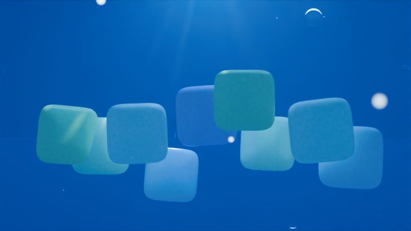

# Frutiger Aero live wallpaper

A Blender project that puts the icon families this repo generates into an
animated, seamlessly looping 3D scene.

The scene is **Aquarium Dock**: nine icons suspended in sunlit water, caustics
crawling over them, light shafts falling from the surface, bubbles rising past.
16:9 desktop, delivered as a seamlessly looping MP4.

How that was chosen, and the five concepts not taken:
**[BRAINSTORM.md](BRAINSTORM.md)**.



*820×461, 96 samples, placeholder tiles — real icons go in `icons/`. Rendered
on 4 CPU cores; a final frame is 2560×1440 at 256 samples.*

---

## The one structural decision

**The `.blend` is an output, never a source file.**

Git cannot merge a binary scene. Two people touching the same wallpaper on
different branches would have no way to reconcile it — one of them just loses
their work. So the scene lives in Python, and `scenes/*.blend` is a build
artefact that is gitignored like `dist/`.

The practical consequence: **do not hand-edit a generated `.blend` and expect
it to survive.** The loop is open it, look, adjust numbers in Blender, then
move the numbers you liked back into the scene module. Rebuilding overwrites.

This mirrors what the web app already does with icon geometry — compile the
shape from a spec rather than letting a tool re-decide it every run.

## Quick start

```bash
cd blender
pip install -r requirements.txt   # the bpy wheel, no Blender install needed

python build.py                   # write scenes/aquarium.blend
python build.py --preview         # ...and render a check frame to out/
python test_fa.py                 # 10 tests, a few seconds
```

Then produce the wallpaper itself:

```bash
python render_loop.py             # render 300 frames, verify, encode to MP4
```

Defaults are the chosen configuration: Aquarium Dock, 2560×1440, 9 icons, a
300-frame loop at 30fps. `build.py --help` lists the rest; the useful knobs
are `--frames`, `--tiles`, `--resolution` and `--seed`.

With a real Blender installed, the same files run under it:

```bash
blender --background --python build.py -- --preview
```

## Getting your icons in

The app keeps rendered icons in IndexedDB and hands them over as a download;
this side just wants a folder of PNGs.

1. Generate a family in the web app.
2. Export, and unzip the PNGs into `blender/icons/`.
3. Rebuild.

Transparent PNGs are expected and handled — open-frame exports keep their
clear centres in 3D. File names become object names, so `folder.png` becomes
`Icon_000_folder`.

**With no icons present the build still works**, using procedural aqua
placeholder tiles laid out identically to the real thing. Framing and lighting
work done before the artwork exists is not wasted.

Which icon lands in the hero position is deterministic: `fa/icons.py` sorts by
a fixed `HERO_ORDER` list, then alphabetically. Never directory order — that
varies by machine, and the hero slot is the one you spent an hour lighting.

## Layout

```
build.py              CLI. Builds a scene, verifies the loop, optionally previews.
render_loop.py        Renders the frame sequence, checks the seam, encodes the MP4.
test_fa.py            Tests for the things that fail silently.
fa/loop.py            Seamless-loop primitives. Read this one first.
fa/geometry.py        The icon tile, from the same superellipse as spec.ts.
fa/materials.py       The Frutiger Aero material library.
fa/environment.py     World, lights, volume, bokeh, camera.
fa/icons.py           Finds exported PNGs and turns them into tiles.
fa/render.py          Render settings, GPU selection, loop-safe encode rules.
fa/scenes/aquarium.py The scene.
icons/                Drop exported PNGs here. Gitignored.
scenes/               Built .blend files. Gitignored.
out/                  Renders. Gitignored.
```

## How looping works

A wallpaper plays frame 1 immediately after frame L, forever. Anything not
exactly periodic hitches once per loop, and a hitch every ten seconds on a
screen someone stares at all day is the one artefact guaranteed to be noticed.

So loopability is a property of how motion is authored, not something tuned at
the end. Every animated value is a function `f(t)` with `f(0) == f(1)`, baked
to a keyframe on every frame. Keys on every frame mean no interpolation
between them, so playback is bit-for-bit the authored function.

Three things in `fa/loop.py` are worth knowing before writing a scene:

- **`travel()` requires whole-number cycles.** A traveller moving at 0.85
  spans per loop is 85% along when the video wraps and snaps back in full
  view. This is the subtle way to break a loop and the function refuses it.
- **`rise()` and `fade_at_ends()` share one clock.** `rise` teleports; the fade
  drives scale to zero on exactly that frame so the teleport is never on
  screen. Give them mismatched arguments and the pop comes back.
- **Noise is animated by walking a circle through it**, not by driving a
  4D noise's `W` with a sine — that ping-pongs, and the pattern visibly
  rewinds. `circular_noise_offset()` returns to its start having travelled
  continuously the whole way.

The loop is verified twice, and the second one is the one that counts.

`verify_loop()` runs on every build and fails it on a discontinuity in the
baked curves. It checks the honest invariant — *nothing visible jumps at the
seam* — so a wrap is allowed when the object has provably shrunk to nothing,
and reported when it has not.

But curves are only what was baked. They cannot see a shader wired up wrong, a
volume that has not converged, or anything evaluated per frame at render time.
So `render_loop.py` measures the seam **on the rendered pixels**, comparing the
wrap against the largest step inside the loop:

```
[fa] loop seam: wrap delta 0.014806, interior peak 0.014864 (1.00x)
[fa] rendered loop verified seamless
```

A ratio near 1.0 means the wrap is indistinguishable from ordinary motion.
That is the actual claim a wallpaper makes, measured on the actual artefact.

## Render budget

Measured on this project's 4-core CPU box, Cycles, the Aquarium Dock scene:

| Output | Settings | Time |
|---|---|---|
| Preview still | 640×360, 64 samples | ~50 s |
| Preview still | 820×461, 96 samples | ~1 min 54 s |
| Final frame | 2560×1440, 256 samples | ~45 min (extrapolated) |
| Full 10 s loop | 300 frames | days — not viable on CPU |

Final renders want a GPU. `render_loop.py` enables one automatically, trying
OPTIX before CUDA (on NVIDIA hardware OPTIX is materially faster for exactly
what this scene is made of — transmission and volume) and keeping the CPU in
the pool alongside it. Cycles on a mid-range discrete card runs roughly 20–40×
a 4-core CPU, putting a 300-frame loop in the region of 5–10 hours: an
overnight job, not an interactive one. Use `--preview` for every iteration.

If frames are too slow, the first dial is `scatter_density` in
`add_atmosphere`. The volume is the most expensive thing in the scene by a
wide margin; absorption is comparatively cheap, so blue distance costs much
less than visible beams.

EEVEE is not available through the PyPI `bpy` wheel — it needs a GPU context
the headless wheel has no way to create. Under a real Blender install with a
display it is available and is the right choice for look development.

## Encoding the loop

`render_loop.py` handles this, but the reasoning is worth knowing.

It renders an image sequence and encodes separately, never straight to video:
a crashed video render leaves an unusable file and hours of nothing, a
sequence leaves every frame it finished. Hence `--resume` (skip frames already
on disk), `--encode-only` (re-encode without re-rendering) and `--start/--end`
(split the job across machines). It refuses to encode a sequence with gaps,
because ffmpeg will happily skip missing frames and hand back a loop with a
jump cut in it.

Two settings in the ffmpeg command are load-bearing:

- **Never encode frame L+1.** The loop is frames 1..L. An extra frame
  duplicates frame 1 at the end and shows as one stalled frame every loop —
  the most common way a technically-correct loop still looks wrong.
- **`-g` must equal the loop length.** Players seek to a keyframe when they
  wrap. A GOP that does not line up means decoding from the previous keyframe,
  and the wrap stutters on exactly the machines you did not test on.

`-pix_fmt yuv420p` is also not optional — the hardware decoders in Wallpaper
Engine, Lively and Android will refuse a 4:4:4 file outright.

The resulting MP4 drops straight into
[Lively Wallpaper](https://livelywallpaper.io/wallpaper-types/) or Wallpaper
Engine as a video wallpaper. Both pause playback under fullscreen apps, so the
idle cost is lower than a 1440p loop sounds.

## What is deliberately not automated

**Compositor bloom.** The aesthetic wants it, and `configure()` explains at
length why it is not there: a Glare node built through `bpy` on Blender 5
links up correctly, reports no error, and then renders a blank white frame in
two seconds having never traced a path. Add it by hand in the Compositing
workspace — Glare set to Bloom, threshold ~0.9, size ~8, strength ~0.35,
between Render Layers and Composite. AgX already rolls highlights off well, so
nothing looks obviously missing without it.

## Why the tile matches the app's geometry

`fa/geometry.py` ports `superellipsePoint` from `src/core/geometry.ts`
exactly, defaults included. The app's whole premise is that the container
silhouette is compiled data rather than something a model draws; putting those
icons on a generic rounded square would break that premise at the last step,
and the mismatch shows as a sliver of wrong-coloured rim around every tile.

The arc-length resampling is carried over for the same reason it exists in
TypeScript: stepping the superellipse parameter evenly crowds points into the
corners. In 2D that gives a lumpy curve. In 3D it also wrecks the shading,
because the specular highlight — the most important thing on a glossy icon —
crawls as it crosses the density change.
