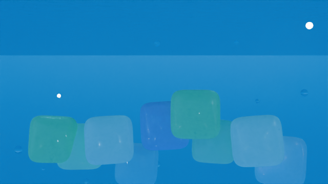

# Frutiger Aero live wallpaper

A Blender project that puts the icon families this repo generates into an
animated, seamlessly looping 3D scene.

Concepts and the research behind them: **[BRAINSTORM.md](BRAINSTORM.md)**.
Nothing is settled yet — one reference scene is built to prove the pipeline.



*Aquarium Dock at 640×360, 64 samples, placeholder tiles. Deliberately an
early pass: the underwater volume, the gel tiles and the loop are working;
caustics are not yet landing visibly on the faces and the waterline is still
just a band. What it demonstrates is that the pipeline runs end to end.*

---

## The one structural decision

**The `.blend` is an output, never a source file.**

Git cannot merge a binary scene. Two people touching the same wallpaper on
different branches would have no way to reconcile it — one of them just loses
their work. So the scene lives in Python, and `scenes/*.blend` is a build
artefact that is gitignored like `dist/`.

The practical consequence: **do not hand-edit a generated `.blend` and expect
it to survive.** The loop is open it, look, adjust numbers in Blender, then
move the numbers you liked back into the scene module. Rebuilding overwrites.

This mirrors what the web app already does with icon geometry — compile the
shape from a spec rather than letting a tool re-decide it every run.

## Quick start

```bash
cd blender
pip install -r requirements.txt          # the bpy wheel, no Blender install needed

python build.py --scene aquarium                    # write scenes/aquarium.blend
python build.py --scene aquarium --preview          # ...and render a check frame
python build.py --scene aquarium --resolution 1080x2400 --tiles 5   # phone
```

With a real Blender installed, the same file runs under it:

```bash
blender --background --python build.py -- --scene aquarium
```

`build.py --help` lists everything. The useful knobs are `--frames` (loop
length), `--tiles`, `--resolution` and `--seed`.

## Getting your icons in

The app keeps rendered icons in IndexedDB and hands them over as a download;
this side just wants a folder of PNGs.

1. Generate a family in the web app.
2. Export, and unzip the PNGs into `blender/icons/`.
3. Rebuild.

Transparent PNGs are expected and handled — open-frame exports keep their
clear centres in 3D. File names become object names, so `folder.png` becomes
`Icon_000_folder`.

**With no icons present the build still works**, using procedural aqua
placeholder tiles laid out identically to the real thing. Framing and lighting
work done before the artwork exists is not wasted.

Which icon lands in the hero position is deterministic: `fa/icons.py` sorts by
a fixed `HERO_ORDER` list, then alphabetically. Never directory order — that
varies by machine, and the hero slot is the one you spent an hour lighting.

## Layout

```
build.py              CLI. Builds a scene, verifies the loop, optionally previews.
fa/loop.py            Seamless-loop primitives. Read this one first.
fa/geometry.py        The icon tile, from the same superellipse as spec.ts.
fa/materials.py       The Frutiger Aero material library.
fa/environment.py     World, lights, volume, bokeh, camera.
fa/icons.py           Finds exported PNGs and turns them into tiles.
fa/render.py          Render settings and the loop-safe encode rules.
fa/scenes/aquarium.py Reference scene.
icons/                Drop exported PNGs here. Gitignored.
scenes/               Built .blend files. Gitignored.
out/                  Renders. Gitignored.
```

## How looping works

A wallpaper plays frame 1 immediately after frame L, forever. Anything not
exactly periodic hitches once per loop, and a hitch every ten seconds on a
screen someone stares at all day is the one artefact guaranteed to be noticed.

So loopability is a property of how motion is authored, not something tuned at
the end. Every animated value is a function `f(t)` with `f(0) == f(1)`, baked
to a keyframe on every frame. Keys on every frame mean no interpolation
between them, so playback is bit-for-bit the authored function.

Three things in `fa/loop.py` are worth knowing before writing a scene:

- **`travel()` requires whole-number cycles.** A traveller moving at 0.85
  spans per loop is 85% along when the video wraps and snaps back in full
  view. This is the subtle way to break a loop and the function refuses it.
- **`rise()` and `fade_at_ends()` share one clock.** `rise` teleports; the fade
  drives scale to zero on exactly that frame so the teleport is never on
  screen. Give them mismatched arguments and the pop comes back.
- **Noise is animated by walking a circle through it**, not by driving a
  4D noise's `W` with a sine — that ping-pongs, and the pattern visibly
  rewinds. `circular_noise_offset()` returns to its start having travelled
  continuously the whole way.

`verify_loop()` runs on every build and fails it on a discontinuity. It checks
the honest invariant — *nothing visible jumps at the seam* — so a wrap is
allowed when the object has provably shrunk to nothing, and reported when it
has not. It has already caught one real bug during development.

## Render budget

Measured on this project's 4-core CPU box, Cycles, the Aquarium Dock scene:

| Output | Settings | Time |
|---|---|---|
| Preview still | 640×360, 64 samples | ~40 s |
| Final frame | 2560×1440, 256 samples | ~45 min (extrapolated) |
| Full 10 s loop | 300 frames | days — not viable on CPU |

Final renders want a GPU. Cycles on a mid-range discrete card runs roughly
20–40× a 4-core CPU, which puts a 300-frame loop in the region of 5–10 hours —
an overnight job, not an interactive one. Budget accordingly, and use
`--preview` for every iteration.

If frames are too slow, the first dial is `scatter_density` in
`add_atmosphere`. The volume is the most expensive thing in the scene by a
wide margin; absorption is comparatively cheap, so blue distance costs much
less than visible beams.

EEVEE is not available through the PyPI `bpy` wheel — it needs a GPU context
the headless wheel has no way to create. Under a real Blender install with a
display it is available and is the right choice for look development.

## Encoding the loop

Render an image sequence, never straight to video: a crashed video render
leaves an unusable file, a sequence leaves every frame it finished.

```python
from fa import render
render.configure_sequence(scene, Path("out/frames"))
print(render.ffmpeg_command(Path("out/frames"), Path("out/loop.mp4"), fps=30, frames=300))
```

Two settings in that command are load-bearing:

- **Never encode frame L+1.** The loop is frames 1..L. An extra frame
  duplicates frame 1 at the end and shows as one stalled frame every loop —
  the most common way a technically-correct loop still looks wrong.
- **`-g` must equal the loop length.** Players seek to a keyframe when they
  wrap. A GOP that does not line up means decoding from the previous keyframe,
  and the wrap stutters on exactly the machines you did not test on.

`-pix_fmt yuv420p` is also not optional — the hardware decoders in Wallpaper
Engine, Lively and Android will refuse a 4:4:4 file outright.

## Why the tile matches the app's geometry

`fa/geometry.py` ports `superellipsePoint` from `src/core/geometry.ts`
exactly, defaults included. The app's whole premise is that the container
silhouette is compiled data rather than something a model draws; putting those
icons on a generic rounded square would break that premise at the last step,
and the mismatch shows as a sliver of wrong-coloured rim around every tile.

The arc-length resampling is carried over for the same reason it exists in
TypeScript: stepping the superellipse parameter evenly crowds points into the
corners. In 2D that gives a lumpy curve. In 3D it also wrecks the shading,
because the specular highlight — the most important thing on a glossy icon —
crawls as it crosses the density change.
