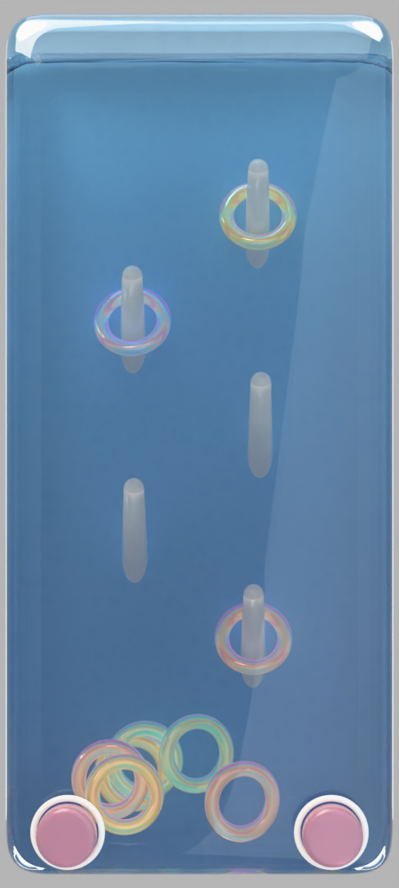

# Water ring toy — Blender pipeline

The handheld water game from the nineties, built as a seamless phone-portrait
loop for a live wallpaper: a sealed water chamber, little plastic rings, pegs
to land them on, and a button at each bottom corner that fires a jet of water
and bubbles up through the chamber, carrying the rings to the surface.

It is glass edge to edge by default — no moulded frame, because a bezel on a
phone screen is a picture of a bezel, and the chamber would rather have the
width. `--shell` puts the coral case back on.

Nothing is hand-placed. `water_ring_toy.py` builds the whole scene — geometry,
materials, the ring motion, the button presses, the jet, the bubbles, the
lighting and the camera — from CLI flags, so a change is a flag rather than a
trip through the UI.



Above: the opening pose. Each ring is a pearl — a pale base tint under a nacre
sheen that walks through the spectrum as the surface turns away from you — and
the rings are where the colour in the scene comes from: they carry enough
emission to spill it onto the plate and the water around them.

It is built on [`liquid_shaker.py`](./liquid_shaker.py) and imports its plan
curve, pillow loft, fill-line boolean and render plumbing directly rather than
copying them, so a fix to that geometry is a fix to both scenes.

## Running it

```bash
# through a Blender install
blender -b -P blender/water_ring_toy.py -- --out renders/ringtoy --encode

# or against the bpy module, no Blender install needed
pip install bpy==4.2.0                      # needs Python 3.11
python blender/water_ring_toy.py --out renders/ringtoy --encode
```

Flags go after `--` when run through Blender, and straight on argv otherwise.
`--help` lists everything.

### Look-dev without waiting

```bash
python blender/water_ring_toy.py --static --loop 1 --preroll 0 \
  --percent 25 --samples 64 --out /tmp/look
```

`--static` skips the motion entirely and renders the opening pose: some rings
already on pegs, the rest settled in the bottom of the chamber. Materials,
lighting, framing and the whole colour story read correctly in about fifteen
seconds.

### Presets

| Goal | Flags |
| --- | --- |
| Look-dev still | `--static --loop 1 --preroll 0 --percent 25 --samples 64` |
| Motion preview | `--loop 150 --preroll 30 --presses 1 --percent 30 --samples 32` |
| Final loop | `--loop 300 --preroll 90 --samples 256 --encode --device GPU` |

The motion itself costs almost nothing — the rings are integrated in Python in
well under a second. Everything you wait for is Cycles.

## How it moves

**Two buttons, one at each bottom corner, and a jet over each.** A press
pushes the button into the glass, opens a wind field in a column above its
nozzle, releases a burst of bubbles into it, and raises a swell on the surface
a few frames later. All four read the same envelope, `jet_level()`, so the
bubbles are *in* the push rather than decoration on top of it. Presses
alternate between the buttons; `--buttons 1` gives the single-jet variant,
centred.

**A press has to be visible to a camera that cannot see it.** The button
travels along the view axis, and the camera is orthographic and dead-on, so
the one thing that physically happens is the one thing this projection cannot
show. The travel stays, because it is what is really going on, but the press
is carried by the two things that do survive: the button lights up, and it
bulges. The bulge is across the face rather than through it — a rubber button
squashes wider as it goes in, and width is the part of that the camera can
see. The rest colour is a soft rose rather than the near-white it goes when lit,
because a button already rendering at the top of the range has nowhere to
light up to.

**A press carries rings to the surface.** That is what the jet is for, and
getting there took more force than it looks: with the drag a ring feels, a
press that only lifts one a third of the way up reads as a twitch. The
falloffs across the column and up it are both deliberately flat, the column
reaches the whole water depth rather than two thirds of it, and `--jet` is
large. Measured at the defaults, eight of the nine rings reach at least 92% of
the water column during the loop.

**Presses live in the front of the loop.** `--press-window` puts them in the
first 45%, and what follows is not dead time: it is the rings sinking back
down and landing on pegs, which is the half of the toy a press cannot show. It
is also what lets the loop close — a ring still near the ceiling when the loop
ends is a ring the rewind has to drag several metres.

**The rings are integrated here, not by Bullet.** This is the one real
departure from the shaker, and it is worth being plain about why. A ring is a
body with a hole in it, and the whole point of the toy is putting that hole
over a peg — which is the one thing a rigid-body solver will not do here:

- a convex hull has no hole, so the ring is a disc and cannot be threaded;
- a concave triangle mesh is not supported for a moving body, and the ring
  sinks through the floor;
- a compound of beads following the stock, which is the shape that *would*
  work, is silently dropped — parenting the beads to the ring they describe
  is a dependency cycle, Blender reports `Detected 16 dependency cycles` and
  the ring ends up with no collision shape at all. Measured: a ring dropped
  onto a bar rests on it with `CONVEX_HULL` and falls 34 metres through it
  with `COMPOUND`.

So `simulate_rings()` integrates them: apparent gravity, water drag, the jet
column, a slow periodic drift, separation from each other, the chamber walls,
and a latch that catches a ring on a peg when it drifts over one slowly and
lets go when a jet hits it harder than `--release`. Every term is something
you can point at in the render, and being ours it is deterministic — the same
seed gives the same loop every time, with no cache to bake.

**A ring goes on over the tip and slides down.** It is caught when the peg's
end is inside its hole on screen, with the ring at or above the tip and near
enough in depth to go on; its target then walks from the tip down the axis to
its place, never straight across through the shaft. The taper does the rest of
the work it does on a real peg: a ring coming down with the tip somewhere under
its stock is funnelled onto it, because without that a landing needs the ring
to arrive already centred, which it almost never is.

**Rings settle at the base and pile up.** Each lands on the one below and the
pile climbs the peg, up to `--stack` rings or the peg's length. A ring's place
in the pile is recomputed every frame, so when one below it is knocked off the
ones above settle down to fill the gap.

**Nothing passes through a post.** A free ring whose stock meets a shaft is
projected out to the surface and loses whatever velocity was carrying it in —
a push was a force, and a ring arriving faster than the force could turn it
went through. The same treatment keeps rings out of the glass bevel at the
side walls and off the buttons, which sit outside the glass but on screen read
as through it.

**The pegs lean out of the back wall** by `--hook-tilt`, and that lean is what
makes them visible. A peg pointing straight at an orthographic camera is a
dot. Leaning it up spends `sin(tilt)` of its length on height and only
`cos(tilt)` on depth, so a steeper peg is both taller on screen *and* cheaper
in the one dimension that is scarce — which is why `--hook-length` can exceed
1.0 and the default leans as far as 62°.

What limits them is the chamber, not the flag. `hook_length()` clamps to what
fits: measured from where the peg is actually mounted, counting the tip, and
leaving a full ring's thickness of clear water ahead of it so a ring can still
float past in front of one — which is how a ring lines up with a peg in the
first place. Past that the pegs stop being pegs and become a wall. If you want
taller pegs than you are getting, the flag to reach for is `--thickness`:
depth is the budget the length is drawn from.

The pegs are mounted forward of the back wall rather than on it, because the
base cap is perpendicular to the peg and swings back through the wall once the
peg leans. They also drift — `--hook-bob` — because a wallpaper is looked at
for a long time and a board that is perfectly rigid behind moving water reads
as a painted backdrop. The float is computed by one shared function so the
keyframer and the solver cannot disagree about where a peg is.

**A hooked ring hangs nearer face-on than square to its peg**, by
`--hook-hang`. Square was a constraint of the rigid-body attempt — a ring
face-on to a leaning peg starts the sim intersecting it — and nothing needs it
now. On a peg leaning 62° a square ring is seen almost edge-on, and gravity
would hang it much closer to flat anyway.

**It is photographed, not diagrammed.** The camera is a 50 mm lens rather
than orthographic — `--lens 0` gets the old view back — and that is what
gives the glass a thickness you can see as a bevel round the frame, and the
pegs a length instead of a dot. The glass wall is thick enough to refract.
The plate is lit by the key rather than painted with a gradient, with a
faint caustic web on it whose coordinates come from the same drifting empty
as the surface ripple, so the light on the floor moves with the water it is
supposedly coming through and returns with it at the seam. There is a
vignette in the compositor (`--vignette`), because the cheapest thing that
separates a photograph from a diagram is that its edges are quieter than its
middle.

Two things tried and reverted: AgX crushes this palette to slate grey, so
the view transform stays Khronos PBR Neutral; and a large key panel reflects
in the front glass as a grey slab under a perspective lens, so the key is
small and high enough that its reflection leaves the frame.

**Everything else is glass.** The posts are opal glass — subsurface for a
body, a hard coat over a matte core, and almost no transmission, because any
real amount lets the blue plate through and a white post reads as smoked
grey. The buttons are frosted rose quartz, part transmissive, so the glow on a
press comes from inside the button rather than sitting on its face. The plate
behind is a pastel gradient rather than a saturated one, and the light rig is
a product-shot rig: every source is large, so every highlight is a soft window
rather than a hot dot, the key is warm and the fill is cool so a white post
and a pearl ring have two colours of light to turn through, and a high
skylight catches the top edge of every ring and post, which is what lifts
them off the plate.

**The rings are pearl, not flat colour.** Two things make a pearl look like a
pearl and neither is its colour. The first is that the hue moves with the
angle: a nacre surface is a stack of thin layers, and what comes back off it
is an interference colour. So the sheen is driven by two angular terms at
once — how much the surface faces the camera, which varies across a ring's
stock, and where its normal points, which varies around the circumference. One
term alone gives a flat band; together they give the shimmer that runs both
ways round a ring. It is then run through the spectrum `--pearl-cycles` times
and folded with a ping-pong rather than wrapped, so the sweep reverses at each
turn instead of cutting back to the start and leaving a seam round the ring.

The second is that a pearl is a pale thing with a colour cast, not a coloured
thing. The five base tints are low-saturation, the hue you read comes mostly
off the sheen, and `--pearl` sets how far the sheen covers the tint — at 0 the
rings are flat pearl colours, at 1 the sheen swamps the tint and every ring
cycles the same rainbow and stops being distinguishable.

It is only part metallic. Fully metallic, a ring stops carrying a colour of
its own and just mirrors the water it is in; the depth comes from a hard coat
over a low roughness instead. There is a little emission for the same reason
the shaker's confetti has some: anything in this chamber is seen through
absorbing water, and without it a pearl arrives grey.

**A peg is a slim, gently tapering shaft with a rounded end.** The taper is
what holds a ring: one dropped over the end slides down until the shaft is as
wide as its hole and stops there. That is easier to land on than a knob — the
target grows as the ring descends instead of having to be cleared in one go —
and it means the end can simply be rounded off rather than carrying a bulb to
stop the ring escaping.

The cap is a hemisphere of exactly the shaft's radius at that point, so it
rounds the end without becoming a bulb sitting on top of it, and
`hook_profile()` follows the sphere rather than a straight line so the
silhouette curves over instead of mitring.

`--hook-base` is the radius where it is mounted, as a fraction of the ring's
hole, and it is the one number that decides how heavy the pegs look;
`--hook-tip` is the radius at the rounded end, as a fraction of the base —
near 1 is a rod with a domed end, small turns it back into a spike;
`--hook-seat` is where along the peg a hooked ring comes to rest. All three
are expressed against the ring, because all three are really statements about
the ring.

## How the loop closes

Every source of motion is periodic by construction:

- **The jet** is keyed only at its own breakpoints and is exactly zero
  everywhere else, so there is no residual forcing at the seam.
- **The bubbles** come in bursts that start and finish inside the loop.
  `--quiet` reserves a tail long enough for the last bubble of the last press
  to expire, and is raised automatically if you set it too short. Between
  presses the chamber is genuinely empty of bubbles, which is also how the toy
  behaves.
- **The surface ripple** is a slow swell at an integer harmonic of the loop
  plus per-press spikes keyed to zero on both sides. Its texture is nailed to
  the world and the *mapping object* moves on a sinusoid, so the pattern
  returns exactly rather than scrolling.
- **The pegs** bob on integer harmonics.
- **The rings** are rewound: over the last `--rewind` frames each is eased
  back toward the pose it held on the first rendered frame — position lerped,
  orientation slerped, with the weight short of 1 on the final frame so it
  steps *into* the first rather than duplicating it.

Measured across all nine rings at the default settings, the seam gap is at
most 0.2 mm of translation and 0.0° of rotation. The shaker's pixel crossfade
is therefore off by default here (`--blend-frames 0`); it exists only for the
case where you set `--rewind 0`, and on hard-edged plastic rings it would
show you two of each.

A ring drifting a few centimetres over two seconds is what rings in water do
anyway, which is why the rewind survives being looked at.

## Flags worth knowing

**`--shell`** brings back the opaque moulded frame, and **`--bezel`** is how
wide it is. With the shell on, the button lives in the chin and is sized off
it; with the shell off — the default — the button sits on the front glass and
is sized off the case.

**`--thickness`** is the chamber depth, and it is the budget the pegs are paid
out of. A shallow toy has short pegs whatever else you set.

**`--fill`** is the water level. The air gap at the top is where the jet
breaks the surface, so 1.0 gives you a beautiful still and no splash.

**`--density`** is the water's absorption, and it is a faint tint rather than
the colour of the toy. The blue you see is mostly the backing plate: a real one
of these holds about a centimetre of water, which tints almost nothing, and the
field the rings are seen against is a sheet of coloured plastic at the back.
The default is low for that reason — enough that the bottom of the chamber
reads deeper than the top, and no more. Crank it and every ring becomes a
silhouette, because the light that reaches one has crossed the volume twice;
take it to zero and the water stops having a body at all and the chamber
flattens into one even field of cyan.

The emission on the rings and the pegs is tied to this. It exists only to hold
them against the absorption, so it comes down as the density does — otherwise
clearing the water leaves everything in it looking lit from inside. What does
*not* come down is `--plate`: the plate is the light the whole field is seen
by, not something compensating for the water, and dimming it alongside the
density just makes a clear chamber look dull.

**`--plate`** glows the backing plate slightly. It is lit from the front
through the water, so without it it arrives dimmer than the rings in front of
it and the picture inverts.

**`--jet` and `--jet-wind`** are the same envelope in different units: the
first is the upward acceleration a ring feels on the jet axis, the second is
the strength of the field the bubbles ride. **`--jet-spread`** is the one to
reach for if a press looks like nothing happened — too narrow a column only
moves what is directly over the hole.

**`--drift`** is the residual swirl in a chamber nobody has touched for a
minute. Turn it off and the rings only ever move in the screen plane, so they
never change depth and never line up with a peg.

## Colour space

Every palette entry in the script is written in sRGB and converted by `lin()`
on the way into a shader socket. Handing them over raw is the quiet way to
lose a palette: sockets are linear, so a mid-saturation coral arrives as pale
pink and reads as a lighting fault rather than a colour-space one. If you pass
`--case-colour`, pass sRGB.

## Verified and not

Built, simulated and rendered end to end against `bpy` 4.2: geometry, the
window boolean, materials, the ring solver, the peg latch, the bubble bursts,
the surface ripple, lighting, camera framing, the seam measurement, the frame
sequence, the crossfade path and the mp4 encode through Blender's own FFmpeg,
so no external binary is needed. The images in this repo's history were
produced that way.

**Not verified:** GPU rendering (`--device GPU`) — there is no GPU here, and
the device-selection code is inherited from the shaker unchanged.

## Known artefacts

Blender prints `Failed to add relation "Animation -> Rigid Body"` for the jet
objects on every depsgraph rebuild. It is an animated force field in a scene
with no rigid-body world; nothing in this scene wants one. The message is
cosmetic and the field animates correctly.

A ring can only be caught by a peg that is free. Two rings never share one,
which is right, but it does mean a chamber with more rings than pegs will
always have rings loose in the bottom — which is also the toy.

Nothing collides rings with pegs, so a free ring is pushed clear of any peg
crossing its stock rather than bounced off it. A ring drawn overlapping a peg
is usually not that case at all: with an orthographic camera a ring floating
well in front of a peg looks like it is on it, and the chamber is deep enough
for that to happen honestly.
