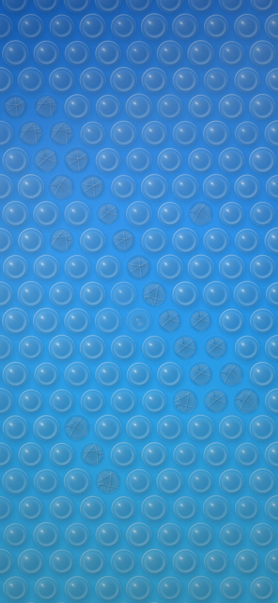

# Bubble wrap — interactive wallpaper

A full sheet of bubble wrap that fills the screen and pops under a thumb. Run
a finger across it and it pops a track; hold on one and you feel it resist,
peak and give. Tilt the phone and the light sweeps across the sheet. Shake it
and a fresh sheet comes in.

One self-contained HTML file, no build step, no dependencies, sibling to the
[liquid shaker](./README.md) it shares its sensor model, colourways and host
interface with.



Above: a thumb dragged from the top-left down the sheet, five separate
presses after it, and one bubble caught part of the way in — the dimple at
its apex is the concave shading that says a finger is winning.

## Try it

Open `bubble-wrap.html` in a browser. Click and drag to pop; the sensors do
the rest on a phone. The [Android notes](./README.md#getting-it-onto-an-android-home-screen)
in the shaker's README apply here unchanged — this page implements the same
`window.__shaker` interface, so the `WallpaperService` in `../android` can
host either page without knowing which one it has.

On a desktop, where there are no sensors: **shift-drag** or the **arrow keys**
stand in for tilting the phone, and **space** or **R** pulls a fresh sheet.

## Why this one, and where it sits in the line

The line so far — the liquid shaker, the water ring toy, the `liquid-core`
icon theme — only knows verbs you perform on the whole device. Tilt it. Shake
it. Every one of those is a single gesture that the whole screen answers at
once, which is why the two existing pages can share a sensor model and why
neither of them cares where on the glass your finger is.

This one adds the verb that was missing: **press**, one finger at a time, at
a place you choose. That is what makes the set a series rather than three
things that happen to be sealed containers, and it is why bubble wrap came
before the other two candidates. An oil-and-water sheet is very nearly the
shaker already — its solver has carried a denser second phase with its own
buoyancy and its own colour since the start, so that one is a tuning pass and
a colourway. A slime is the shaker's solver with a different constitutive law
in it, which is a real piece of work but still answers the same gestures.
Neither of them teaches the line anything it did not know.

## How it pops

The pop is not a state flag flipped on touchdown. It is the end of a short
causal chain that runs in full for every bubble on the sheet, and every link
of it is load-bearing.

**Each dome is a shallow elastic shell with a snap-through landscape.** One
degree of freedom per bubble — `u`, how far the apex has travelled inward, in
units of the dome's own rest height, so `u = 0` is the moulded shape, `u = 1`
is flat and `u = 2` is fully inverted. The shell force is a shallow arch:

```
u'' = press - SHELL·u(1-u)(2-u) - GAS·pg(u) - DAMP·u'
```

That cubic's potential has minima at `u = 0` and `u = 2` with a barrier
between them, so it resists up to the flat state and *helps* beyond it. Its
peak is at `u = 0.42`, not at `u = 1` — the resistance under a thumb rises,
peaks well before the dome is flat, and then abruptly gives way. Everything
about the feel follows from where that peak is.

**The air inside is sealed.** Isothermal, so pressure goes as `1/V`, and the
cap's volume falls roughly linearly with the apex, floored at the residual
the rim cannot squeeze out. This is the term that diverges, and it is the one
that actually bursts the bubble: the shell gives way first, the apex dumps
inward over a couple of frames, and the pressure spike that dump produces is
what fails the seal. **So the pop is downstream of the buckling rather than
beside it**, which is also the true story — bubble wrap bursts because it
snaps, not the other way round. Measured: a steady hold buckles a dome to
`u = 0.66` and lets go 0.2 seconds after the finger lands.

**Every seal is different.** This is the single most important number on the
sheet. Give every dome the same burst pressure and the wrap becomes a
keyboard: every press pops, at the same depth, with the same sound. Real film
varies in thickness and in how well each weld took, so the thresholds are
spread ±34% about the median — some go under a fingernail, some want a thumb
leaned on them, and hunting for the stubborn ones is most of why anyone picks
the stuff up in the first place.

**The films are one sheet.** A membrane tension field lives on the lattice
and obeys a damped wave equation. Pressing sources it; a burst fires an
impulse into its *rate*, so the release travels outward as a bipolar ripple
rather than spreading like a stain. A taut film bursts at a lower pressure,
so the ripple takes any bubble that was already close.

Measured, a burst peaks the field at 0.99 in its own cell — the cap — so its
immediate neighbours have their burst pressure cut by the full 34%. That
sounds like a chain reaction and is not one: the ripple is gone in about a
fifth of a second and only the ring next door ever sees the peak. Twenty-three
presses down a thumb-run produce nineteen pops, and a single burst in the
middle of an untouched sheet takes nobody with it. What it does do is finish
off the bubbles the same thumb was already leaning on, which is exactly what
real wrap does and what a grid of independent buttons cannot.

**The press is a load, not a displacement.** The obvious implementation moves
the apex to wherever the finger is, and it throws away the entire point: a
displacement-driven dome cannot snap, because snapping is the apex running
away from the load once the shell softens.

The contact patch was wrong on the first pass and the sheet was unusable for
it. A patch of 0.62 pitches with a smoothstep peaking at its centre is
*smaller than the lattice circumradius*, so a press landing between three
bubbles reached every one of them only at the edge of its falloff. Measured, a
finger held for a third of a second on the worst spot on the sheet got the
nearest dome 5.8% of the way in, against the 42% it has to pass to buckle at
all. Taps did nothing, at random, and "at random" was the part that made it
feel broken rather than hard.

Neither half of that was physical. Contact pressure under a fingertip on a
compliant sheet is close to uniform across the patch and eases off at the rim;
it is not a spike at a point. And the finger people actually use on bubble
wrap is a thumb, which is nearly twice the pitch of small wrap across — so it
always covers a dome centre, and it always leans on the ring of neighbours as
well, which is where the occasional double pop comes from. With a flat-topped
patch of 0.9 pitches, the same held press reaches `u = 0.39` in eighty
milliseconds and takes three bubbles.

## How it looks

**A dome is not a bump.** It is a lens full of air sitting on a coloured
backing, and almost everything you see through it is that backing — so the
body has to stay out of the way. Painting it as a shaded solid, which is the
obvious reading of "draw a hemisphere", produced a sheet of moulded rubber
matting: every dome a grey lump, the colour of the wrap coming only from the
gaps between them.

What is actually there is four thin things over an unchanged backing: a milky
lift from the film's own haze, a bright arc where the rim faces the lamp, a
dark hairline all the way round that draws the silhouette, and the caustic the
dome throws onto the far side of *itself* by piping light through its wall.
The last one is the whole trick. It is the brightest thing on the dark side of
the bubble, which is impossible for a solid, and it is the reason a clear one
reads as clear.

**Past a quarter of the way in, a dimple opens at the apex** with its
terminator the other way round — bright where the dome was dark, because the
surface is now concave. In a dead-on orthographic view that is the only cue
that the finger is going *in* rather than the bubble getting smaller, and
without it a press reads as a shrink.

**A dome is a circle, and a circle lit from any direction is the same picture
rotated.** So the shading is painted once at a canonical light and turning the
phone rotates the table rather than repainting it — two dozen blits when the
lamp moves far enough to notice, against a few hundred gradients a frame if
the shading were live. The compression is what the table indexes, because that
genuinely changes the picture.

**A spent bubble keeps its weld ring.** The land around each dome is embossed
into the sheet, so it outlives the air, and a popped patch that has lost its
rings stops looking like wrap. Those rings are also static, which is why they
live in the backing layer rather than being blitted 275 times a frame — that
was the single most expensive thing this page did, and all of it was redrawing
the same picture.

The creases on a collapsed bubble were five or six chords through the centre
of the disc on the first pass, which is a snowflake: radially symmetric, every
crease crossing every other at one point, and reading at a glance as a drawn
asterisk. Film does not fold that way. It buckles into two or three long
creases that run *past* each other, each with its own centre of curvature,
none through the middle.

## The two gestures that are not the finger

**Tilt sweeps the light.** A lamp is fixed in the room, so in the phone's
frame it swings round as the phone turns, and a sheet of plastic under a
moving light is mostly a moving highlight. It is the cheapest honest use of
the accelerometer here and it costs one sprite-table rotation.

**Shake pulls a fresh sheet.** A wallpaper you can exhaust is a wallpaper with
an ending, and re-inflating everything on a timer where you can watch reads as
the thing undoing your work. So the refill is a gesture with a direction: a
front crosses the sheet the way you shook it — 0.65 seconds end to end — and
the domes it passes come back *over*-inflated and settle out on their own. The
bounce is not an easing curve. The same cubic that lets a dome buckle inward
is restoring on the other side of zero, and the air inside an over-inflated
bubble is rarefied and pulls with it, so the physics was already there.

Under that there is a slow floor: a popped bubble quietly comes back after
about forty seconds, staggered. `?refill=0` turns it off and the sheet stays
spent.

## Sound and touch

The pop is synthesised rather than sampled, so it is a function of what the
simulation actually did: a small bubble clicks higher than a big one, and a
seal that held out to a higher pressure lets go harder and brighter. One
sample played back at one volume is the tell that the pop is a trigger and not
an event. Two voices — a bandpassed noise burst for the split, gone in forty
milliseconds, and a triangle an octave and a bit below for the film's own
edges snapping back — panned by where on the screen it happened, and capped at
ten simultaneous so a cascade cannot clip.

`navigator.vibrate` fires with it, debounced to 45ms so a cascade does not
turn into a continuous hum. `?sound=0` and `?haptics=0` turn either off.

## Options

Append as query parameters, e.g. `bubble-wrap.html?cols=6&refill=0`.

| Parameter | Default | Meaning |
| --- | --- | --- |
| `mode` | `full` | `full` fills the screen; `pouch` floats a discrete squircle on a backdrop |
| `cols` | `9` | Bubbles across. Sized in bubbles rather than pixels, so a phone and a laptop get the same *material* instead of the same picture scaled |
| `dome` | `0.62` | Dome height as a fraction of its radius |
| `ramp` | shaker's blue | Backing colours, read along the gravity axis. The same parameter, with the same default, as the shaker |
| `film` | `#eaf3f8` | Polyethylene. Faintly cool, faintly milky, never white |
| `glass` | `0` | 0 is opaque backing (a wallpaper); 1 drops the backing entirely so an icon shows the home screen through the wrap |
| `refill` | `40` | Seconds before a popped bubble quietly returns; 0 leaves them popped |
| `seed` | `20260831` | Names a sheet. The same seed gives the same thresholds, jitter and creases on every device |
| `sound` | `1` | The synthesised pop |
| `haptics` | `1` | `navigator.vibrate` on each pop |
| `n` | `4` | Corner squareness in `pouch` mode: 2 circular, 4 squircle, 8 nearly square |
| `scale` | `0.78` | Patch size against the short edge (`pouch` mode only) |

`cols` is the dial that matters for cost: it is quadratic in bubble count.
Nine across on a 9:19.5 phone is 275 bubbles.

## Verified

Driven headless in Chromium at a 393×852 viewport with a hand-turned clock and
a seeded PRNG, so runs are comparable. No runtime errors, with rest, a held
press, a thumb-run, a tilt sweep, a home-screen swipe, a fresh sheet and the
full audio path all exercised.

| Property | Result |
| --- | --- |
| Frame-rate independence (same thumb-run at 30, 60, 144fps) | 19 pops, 19 pops, 19 pops |
| Determinism from `seed` | identical sheet twice; a different seed differs |
| A steady held press | buckles to `u = 0.66`, first pop at 0.20s, takes 3 |
| Burst-threshold spread | 1.20 – 2.45 atmospheres gauge, median 1.62 |
| A burst's ripple | peaks at 0.99, weakening a neighbour's seal by 34% |
| Fresh sheet after 178 pops | front crosses in 0.65s, 178 → 0 |
| Frame cost | 36fps at 275 bubbles with a finger down |

That frame rate is a **software rasteriser in a container** and is a floor,
not a measurement of a phone: there is no GPU here. It is also three times
what the first working version managed, and both of the differences were
static pictures being redrawn every frame — the four full-screen gradients
that make the backing and the gloss now bake into two layers on the same
threshold that rebakes the dome table, and the weld rings went into one of
them.

**It has never run on a handset.** Same caveat as the shaker, and for the same
reason: there is no device here. Everything above is a headless browser.

## What the line wants next

The two candidates this one beat are both still worth building, and in this
order:

**Oil and water** is nearly free. The shaker's solver already carries a
denser second phase with its own buoyancy, its own dispersion and its own
colour — that is where its teal comes from, and it is deliberately not a stop
on the ramp because the whole point of the pairing is that it is a *different
fluid*. Turning that into an immiscible pair is a matter of interfacial
tension and a much lower miscibility, and it lands as a colourway plus a
tuning pass on a file that already exists.

**Slime** is the real piece of work: the shaker's solver with a
shear-thinning, yield-stress constitutive law in place of the Newtonian
viscosity, so it holds its shape until you push hard enough and then flows.
It wants dragging as a verb — a finger that stretches the material rather than
loading it — which is neither of the two verbs the line has now, so it is the
next one that would teach the set something.
