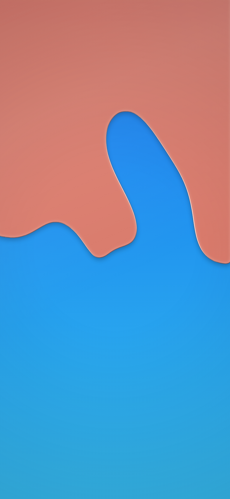

# Oil and water — interactive wallpaper

A sealed cell of oil over water that fills the screen. Tilt it and the layer
finds level. Drag a finger through it and it shears, draws out filaments and
pinches them off into droplets. Shake it and the whole thing tears apart, then
rises, runs back into itself and rebuilds one layer over about twenty seconds.

One self-contained HTML file, no build step, no dependencies. Third entry in
the sealed-container line, after the [liquid shaker](./README.md) and the
[bubble wrap](./BUBBLE-WRAP.md), sharing their sensor model, their `ramp`
parameter and their `window.__shaker` host interface.



Above: a second after a two-and-a-half second shake. Every boundary is curved
and rounding itself off, with a bead of oil already pinched free into the
water — which is interfacial tension doing the only thing it does, minimising
perimeter. Before the sign of that force was fixed, the same moment came out
as spikes and spears. The light and dark bands lying across both liquids are
their surfaces being carried by the same velocity field.

## Try it

Open `oil-water.html` in a browser and drag to stir. On a desktop, where there
are no sensors, **shift-drag** or the **arrow keys** stand in for tilting the
phone and **space** or **S** shakes it.

## What the plan said, and what was actually true

The note at the end of the bubble wrap's write-up said this one was nearly
free — that the shaker already carried a denser second phase, so oil and water
was a colourway and a tuning pass on a file that already exists.

That was wrong, in one specific and load-bearing respect. The shaker's second
phase is a **dye**: a scalar advected by the flow, given buoyancy, with
nothing in it that says two fluids cannot mix. It marbles. Marbling is exactly
right for a glitter shaker and is the one thing oil and water never do.
Immiscibility is not a tuning constant; it is a term in the equation of
motion, and the file did not have it.

The rest of the estimate held up. The velocity solver, the shake model, the
sensor handling and the colourway system all came across nearly unchanged.
It was the one sentence about the second phase that was doing all the damage.

## How two fluids refuse to mix

The dye is replaced by a **phase field**: `phi` running from -1 (water) to +1
(oil), advected by the flow, and relaxing under a free energy with two wells:

```
f(phi) = (phi² - 1)² / 4  +  (eps²/2)|grad phi|²
```

The double well is what separates them. Every intermediate value is uphill, so
a half-mixed cell rolls to one side or the other; there is no stable state in
between, which is what "immiscible" means. The gradient term is what stops the
interface collapsing to nothing and gives it a width of about three cells.

The variation of that energy is the chemical potential

```
mu = (phi³ - phi) - eps² lap(phi)
```

and `mu` does two jobs. Relaxing `phi` down its own gradient separates the
phases and holds the interface width. Feeding `mu * grad(phi)` back into the
momentum equation **is** the interfacial tension force — in the form that does
not require knowing the curvature of anything.

That second half is where the visible behaviour comes from, and it is worth
being precise about how little is written down. **Roundness, coalescence and
pinch-off are not three features.** They are one force, and it points the same
way in all three cases: toward less interface. A droplet is round because that
is the shortest boundary around its area. Two that touch merge because one
boundary is shorter than two. A filament drawn out by shear beads up because a
row of spheres has less surface than a cylinder. Nothing in this file knows
what a droplet is.

The check that this is really what is happening: set the mobility to zero, so
the field advects but never relaxes, and the page becomes the shaker's dye
again — measured, the interface smears across 96% of the cell and never
separates. The relaxation is the immiscibility, and nothing else is.

### The sign of that force was wrong, and it was the whole problem

The Korteweg force is `+mu * grad(phi)` — equal to `-phi * grad(mu)` up to a
gradient the pressure projection absorbs. This shipped with the minus, which
is an *anti*-surface tension: a force that pays to make interface rather than
to remove it.

Check it on a droplet. Oil is `phi = +1` inside, so `phi` falls outward and
`grad(phi)` points inward. At the rim `mu` is about `-eps² * phi_r / r`, and
`phi_r` is negative, so `mu` is positive. Positive times inward is inward —
the Laplace pressure squeezing the drop into the smallest boundary that will
hold it. With the minus it points outward, and every bump on the interface is
a bump the force makes bigger.

Everything about how this looked followed from that one character. Blobs had
corners and spikes and long thin spears, because nothing was pulling them
round. Filaments never beaded. And the harder the coefficient was driven the
worse it got — which is why it had been tuned *down* from 900 to 300 over
several passes, each one reducing a bug rather than a parameter.

The measurement that settles it is one line: **plant a square in still liquid
and ask whether it becomes a circle.** The isoperimetric quotient `4πA/P²` is
1.0 for a circle and 0.79 for a square, so this is a number, not an opinion:

| | t=0 | 0.5s | 1s | 2s | 4s | 8s | 16s |
| --- | --- | --- | --- | --- | --- | --- | --- |
| square, wrong sign | 0.81 | 0.82 | 0.81 | 0.76 | 0.65 | 0.51 | **0.47** |
| square, wrong sign, ×8 coefficient | 0.81 | 0.73 | 0.55 | 0.34 | 0.38 | 0.21 | **0.17** |
| square, fixed | 0.81 | 0.86 | 0.94 | **0.99** | 1.00 | 1.00 | 1.00 |
| plus-sign, fixed | 0.69 | 0.78 | 0.93 | **1.00** | 1.00 | 1.00 | 1.00 |

(With gravity switched off, so the only thing acting is the tension. Left on,
a planted square also rises and deforms, which is a different question.)

It hid for a long time, and the way it hid is the interesting part.
Allen–Cahn relaxation *is* mean-curvature flow, so the phase field rounds
shapes on its own, independently of the hydrodynamics. At the mobility this
originally shipped with, that relaxation was outrunning the bad force and the
interfaces looked plausible. Lowering the mobility while chasing fragmentation
took the cover away. So the bug was introduced on the first day and only
became visible three commits later — long after the code that contained it had
stopped being what anyone was looking at.

Two things follow that are worth keeping. First, `stats().roundness` is now a
first-class diagnostic and `__shaker.plant()` is a permanent fixture, because
the one-line statement of what interfacial tension is *for* is "it minimises
perimeter", and nothing in the page could ask that question. Second, every
constant tuned before the fix was tuned against it: the tension coefficient
has gone back up to 600, and the measurements below were all retaken.

### Conserving mass globally was deleting the droplets

The relaxation started as **conservative Allen–Cahn**: run down the free
energy at rate `-M·mu`, then subtract a single global Lagrange multiplier,
spread over the interfaces, so the total came out unchanged. It conserves the
total exactly, and it is wrong in a way that turned out to be most of why this
never looked like oil and water.

A global correction conserves mass *globally*. It does not conserve it
anywhere in particular. Mass taken off one interface reappears on another at
the far end of the cell, and because curvature flow shrinks the most sharply
curved features fastest, **the smallest droplets pay for the largest**. This
is a known failure of the formulation, described in the literature in exactly
those terms: small features dissolve into the bulk because the correction is
global.

Measured here, gravity off and nothing else acting — five planted droplets of
radii 0.28 down to 0.06:

| | t=0 | 5s | 20s | 40s | total oil |
| --- | --- | --- | --- | --- | --- |
| global Lagrange multiplier | 5 | 4 | 2 | 2 | 0.059 throughout |
| Cahn–Hilliard | 5 | 5 | 4 | 4 | 0.059 throughout |

Nothing touched them. They evaporated into each other while the books
balanced. No amount of tuning the interfacial tension could have produced a
dispersion that the bookkeeping was quietly removing.

**Cahn–Hilliard** needs no such term: `∂φ/∂t = M∇²μ` is the divergence of a
flux, so mass is conserved cell by cell by construction and a droplet can only
lose mass by transporting it to a neighbour. Small drops do still slowly feed
big ones, but that is Ostwald ripening — real physics, at a rate set by how
far the mass has to move, rather than an artefact acting at a distance. It
costs a fourth-order stability limit, `dt·M·ε²·64 < 2` on this stencil, which
caps the mobility near 1.3 at a sixtieth of a second.

### The advection was destroying the interface every step

The phase field was moved with the same first-order semi-Lagrangian step as
the velocity, and for an interface that is a disaster. Each step interpolates
bilinearly at a backtraced point, smearing a sharp boundary across a cell;
each step Cahn–Hilliard then re-sharpens whatever the smearing left. The two
fight sixty times a second, and what survives is not the shape the flow would
have produced — it is a shape repeatedly blurred and re-hardened. That is
where the frozen-in points and tendrils came from. A corner on a real
interface has enormous curvature and retracts almost at once; these survived
for ten seconds because they were being re-created faster than tension could
remove them.

It now uses **MacCormack** with a limiter — advect forward, advect back, and
half the round-trip error corrects the forward result, clamped to the range of
the four values the forward step interpolated between. Without the limiter it
rings, and a ringing phase field grows droplets out of nothing.

## Three more things that were wrong

All three presented as the same symptom — the cell never came to rest — and
none of them were what that symptom looked like.

**The buoyancy force had a non-zero mean.** The oil is 42% of the cell, so
`phi` averages -0.15 rather than 0, so a force proportional to `phi` has a net
uniform component. A uniform force is precisely the thing a pressure
projection cannot remove, because it is already divergence-free. So it
survived every step and accelerated the entire body of liquid until viscosity
balanced it: a permanent 126px/s drift that no amount of damping or vorticity
tuning touched, because neither was causing it. Buoyancy is measured against
the mean density, not against zero; the missing term is the container pushing
back with the net weight of what it holds. **126 → 113px/s.**

**The pressure was cleared every frame.** Two fluids of different densities in
layers need a pressure field varying across the whole height of the domain to
hold them up. That is the lowest spatial frequency there is, and a relaxation
method is at its worst on low frequencies: eighteen Gauss–Seidel sweeps carry
information eighteen cells, and the grid is a hundred and fifty-six tall.
Started from zero each frame the solve never got close, and the leftover
buoyancy drove a permanent circulation. Warm-starting costs nothing — the
hydrostatic field is nearly the same from one frame to the next, so the solver
refines an answer it already has instead of rediscovering it, and the
divergence is recomputed from scratch anyway so a stale pressure can only be a
better initial guess than zero. **113 → 4px/s.** That is one deleted line.

**Viscosity was a decay, and a decay cannot do this job.** The job has two
halves that pull against each other: shaking has to fragment the layer, which
needs the flow to survive long enough to fold it, and settling has to take
tens of seconds, which needs droplets to rise slowly. One decay constant
cannot be both small and large, and every value tried was either a shake that
did nothing or an emulsion that unmixed itself in two seconds.

Diffusion is not one constant. Damping goes as `nu·k²`, so bulk flow is
long-wavelength and barely feels it while a droplet's flow field is as small
as the droplet and is damped hard. The speed a droplet rises at settles to
force over damping, which — because damping goes as `k²` — is proportional to
the square of its radius. **That is Stokes' law, and it arrived by writing the
viscous term down properly rather than by being asked for.** It is also why a
shaken bottle clears from the top down: the big drops go first.

## The one number that is a lie

`SHAKE_GAIN` is 180: each g of hand motion is worth a hundred and eighty g of
effective gravity. It is named in the source rather than buried, because it is
worth being straight about which part of this is physics.

A completely full, sealed, rigid cell of oil and water, shaken by a real hand
at a real two or three g, does very nearly nothing. That is not a failing of
the model — it is why you shake a bottle that has air in it. With no headspace
the only forcing is the effective gravity acting differentially on the two
phases, and with the real density difference of oil and water, about a tenth,
that forcing is weaker than the buoyancy already holding the layer together.

Measured again after the sign fix, since the first figure was taken against a
broken force and could not be trusted: at a realistic gain a two-and-a-half
second shake at 2.5Hz moves the interface length by four per cent — 228
crossings against a resting 220 — and leaves the oil in one piece at a
roundness of 0.79, unchanged. At the shipped gain the same shake takes it to
1182 crossings, nineteen separate bodies and a roundness of 0.04.

| effective gain | peak perimeter | peak bodies | lowest roundness |
| --- | --- | --- | --- |
| 4.5 (realistic) | 228 | 1 | 0.79 |
| 20 | 256 | 1 | 0.73 |
| 60 | 562 | 8 | 0.17 |
| 180 (shipped) | 1182 | 19 | 0.04 |

So the gain is dialled far above life, deliberately. What it buys is the thing
the product is for. What it costs is a claim nobody should read as a
measurement.

One real thing did fall out of testing it: **the response is far more
sensitive to frequency than to amplitude.** A 2.5Hz shake fragments the layer
where a 4.5Hz shake at the same gain barely marks it, because this is a
parametric (Faraday) instability and it needs time within each half-cycle to
grow. A hand shakes a phone at about two to three hertz, so the resonance is
in the right place by luck rather than design.

The finger needs no help. Dragging through a liquid really does impose your
own velocity on it, so the stirring is honest at gain 1 — and it is a drag
rather than a push outward, because a radial source is pure divergence and an
incompressible fluid cannot expand away from a poke. The projection deletes
all of it. (Measured in the shaker, where the same mistake was made first.)

## Drawing a liquid that has an edge

The field is 56 cells across and the screen is 393. Drawing it as an image and
letting the compositor interpolate gives a soft cloud, and soft is the one
thing an oil droplet is not — the characteristic read of oil in water is a
hard edge with a bright line of refraction sitting on it.

So the `phi = 0` isoline is extracted as actual polygons by marching squares,
and everything after that is drawn at full resolution with gradients, strokes
and clips. Contouring is one pass over the grid and it buys a crisp silhouette
that no amount of upscaling can.

Two details that make it robust rather than nearly-working:

- **Crossings are keyed by which grid edge they lie on**, not by their
  coordinates, so linking segments into closed loops is exact integer
  bookkeeping instead of hashing floats and hoping.
- **The field is extended by a ring of water** before contouring. Without it,
  a layer of oil spanning the whole cell produces an open contour that runs
  off two edges and never closes, and an open path cannot be filled. With it,
  every loop closes off-screen and the visible area is still covered edge to
  edge.

The extracted polygons then get two passes of **Taubin smoothing**. The field
is smooth; the polygon is not — marching squares puts a vertex on every grid
edge the isoline crosses and joins them with straight segments, so the outline
picks up angular detail at the cell scale that is an artefact of the sampling
and is not in the field being sampled. Taubin rather than plain Laplacian: a
shrink pass followed by a slightly larger unshrink pass, because plain
smoothing would quietly eat the oil and this page has spent enough effort
conserving its mass not to want the renderer losing it again.

The segments are directed so oil is always on the left of travel, which makes
the winding consistent, which makes a hole in a blob fill as a hole under the
nonzero rule instead of as more oil. `stats().drawnArea` is the renderer
checking itself against the solver — the contour is a separate representation
of the same field, so a case-table error shows up as the two disagreeing
rather than as something subtle found later on a phone.

## Making it look like a liquid, which took three goes

The crisp silhouette was necessary and nowhere near sufficient. The first
version filled the contour with a gradient running down the *screen* and drew
a hairline around it, and the verdict on it was blunt and correct: it did not
look like liquid at all. It looked like cut paper — which is exactly what was
drawn. A flat colour field bounded by an outline is what a paper cutout *is*.
Nothing in the picture varied with the shape of the thing it was painting, so
nothing in it could say "body of liquid" rather than "region".

The second version went the other way and stacked six translucent washes —
inner shadows for thickness, a light flank, a dark flank, a caustic halo — and
turned the oil brown. Six semi-transparent layers each carrying a different
idea average to mud, and the additive halo read as a sticker glow.

What was actually missing was not inside the blob at all. Three things were,
and two of them were bugs rather than matters of taste.

**Every highlight on the page was sub-pixel.** The strokes were specified as
fractions of a cell, and a cell is about seven CSS pixels — so `cell * 0.055`
is four tenths of a pixel. The meniscus, the wet line, the rim: all of them
were being drawn at widths that cannot appear. There was no bright mark
anywhere in the frame, and **a picture of a liquid with no specular in it is a
picture of a piece of paper.** Fixing that alone did more than every wash in
the second version put together.

**The velocity field was not being drawn**, and the fix for that was a
mistake — a long, well-argued, thoroughly measured mistake, and it is worth
recording as one.

The reasoning went: a still liquid is a mirror, a moving liquid is a mirror
being bent, and the bright and dark bands sliding across it are the single
most recognisable thing about the material. So the surface got a height field
of its own — three octaves of value noise, advected by the same flow that
carries the oil, shaded by dotting its gradient into the light, normalised
against a running average of its own magnitude, with a glint pass on the
steepest few per cent. Four separate sub-problems were found and solved along
the way (a sine-product pattern reads as woven fabric; nothing finer than four
cells survives the upscale; the gain spans four orders of magnitude between
rest and shake so it cannot be a constant; contrast and amplitude are
different questions). It also turned up a real bug in `bounds()`, which
carried velocity and phase across the wall ring but not the noise field, so
the ring kept its seeded values while the interior evolved away from them and
the glint turned that one-cell cliff into a blown-out white border.

All of that was correct work on the wrong idea. Every octave of it was texture
laid over **both** phases, and mottling on a flat colour reads as sponged
plaster on the water and as marbled stone on the oil — the opposite of the
wet, poured look the page exists for. Worse, it competed with the only thing
that actually carries the read here, which is the shape of the boundary.

It is gone: the noise field, its advection, its re-roughening, its share of
the boundary conditions, the relief pass and the glint pass. The frame rate
under the software rasteriser went from 13 to 26fps, which is the other half
of the cost that was being paid for it.

What survives from that whole section is the first bullet — the highlights
were sub-pixel and now are not — and it is still the largest single
improvement made to how this page looks. The meniscus, the wet line and the
rim are the specular now, and they sit exactly where the eye wants them,
which is on the edge.

## The oil's outline: ridges per blob

An oil blob's outline should be a few long curves. This one was crenellated,
and neither of the metrics here said so: thickness averages over whole bodies,
and roundness scores a smooth ellipse and a smooth peanut differently while
scoring a smooth circle and a gently rippled one almost the same — backwards
for this question.

So `lobes` counts it directly: the discrete curvature at every vertex of a
loop, smoothed hard enough that a single lattice cell cannot register, and its
sign changes tallied. Each convex bulge separated by a concave neck is one
crossing pair, so a circle or an ellipse scores 0, a peanut 2, a starfish 10.
It read 20 to 34 straight after a shake.

The cause was the momentum diffusivity, and the reason it had never been tuned
is that **it could not be**. The viscous step is an explicit Laplacian, which
is unstable above a coefficient of 0.25 in two dimensions, so it clamped at
0.24 — but `nu * dt` was already 0.53 at the default, so the clamp was always
active. Raising `nu` from 32 to 64 to 128 returned bit-identical runs. The one
knob that damps the small-scale flow that corrugates a boundary was pinned at
a ceiling and silently discarding its input.

Splitting the same diffusion into *n* passes of `kd/n` each is stable and is
the same operator, so the coefficient became free:

| `nu` | ridges at shake end | +1s | +3s | +10s | mean thickness |
| --- | --- | --- | --- | --- | --- |
| 32 | 20 | 10 | 6 | 4 | 121 px |
| 60 | 8 | 6 | 6 | 0 | 163 px |
| **90** | **4** | **6** | **6** | **0** | **183 px** |
| 130 | 4 | 4 | 6 | 0 | 192 px |

90 is where the outline becomes a few long curves, and it is as far as this
should go — past it the cell is too viscous for a shake to deform the layer.

Capping the *pass count* at eight rather than the viscosity reintroduced the
identical bug one layer down: at `nu = 180` the per-pass coefficient went back
over 0.25 and the field went to NaN. The ceiling now sits on the viscosity,
where it is stated, and the passes follow it.

**Vorticity confinement is off.** It exists to put back the small eddies a
coarse advection scheme dissipates, and it worked — which was the problem. It
was manufacturing precisely the ridges the viscosity is spent removing. Off
takes the count from 6 to 4 and costs nothing else.

**The tap had to be rebuilt to survive it.** A shear pulse of 1.6 contact
radii at 620px/s is small-scale motion, which is what the new viscosity exists
to erase: measured, a tap moved the oil's perimeter by half a per cent and was
gone in a quarter second. Radius does most of the work — at five radii and
2,600px/s the oil bulges by a fifth and heals over about three seconds, which
is what a finger in a viscous liquid does.

## Options

Append as query parameters, e.g. `oil-water.html?oil=0.6&tension=0.4`.

| Parameter | Default | Meaning |
| --- | --- | --- |
| `mode` | `full` | `full` fills the screen; `pouch` floats a squircle on a backdrop |
| `grid` | `96` | Cells across, and the most important number here. It sets the smallest droplet that can exist — an interface is about three cells wide, so a bead is never smaller than four or five — and therefore whether this behaves like two liquids at all. At 56 a shaken ribbon is seven cells across with three of them interface: no bulk to neck, so it cannot break into drops |
| `oil` | `0.42` | Oil as a fraction of the cell. Past about two thirds the water is the minority phase and the emulsion inverts, which is real and looks odd |
| `ramp` | shaker's blue | The water, along the gravity axis. Same parameter and same default across all three pages |
| `tint` | `#e8806c` | The oil. Ember Glow — the two phases have to differ in *hue*, or the separation the physics works so hard at is invisible |
| `tension` | `1` | Interfacial tension, as a multiple of 12,000. Low is ragged and slow to round up; above about 1.5 the oil re-separates into one layer within seconds of any shake, which is right and dull |
| `gain` | `25` | How far above life the accelerometer is amplified. This is the number that decides whether the oil holds together — see below |
| `eps` | `1.8` | Interface half-width in cells |
| `mob` | `0.25` | Phase-field relaxation rate. Its ceiling is Cahn–Hilliard stability, `dt·M·eps²·64 < 2` |
| `sm` | `24` | Contour smoothing passes |
| `buoyancy` | `1` | Density difference. At 0 the fluids weigh the same, they never separate, and shaking does literally nothing |
| `visc` | `1` | Multiplies `nu`. Momentum diffusivity sets how fast droplets rise and, through it, how many ridges the oil's outline carries |
| `nu` | `90` | Momentum diffusivity in cells²/s. The ridge knob — see above |
| `vort` | `0` | Vorticity confinement. Non-zero puts back small eddies, and corrugates the oil |
| `glass` | `0` | 0 is opaque water (a wallpaper); 1 drops the water so an icon shows the home screen through the cell |
| `seed` | `20260831` | Names a cell: the same seed gives the same starting interface and the same sequence of shakes |
| `n` / `scale` | `4` / `0.78` | Corner squareness and size, `pouch` mode only |

## The measurements in this file were noise until the harness was fixed

This section used to claim the page was driven "with the clock stubbed before
the page's own script runs, so no real frame ever steps the solver". That was
not true, and it is the reason this page went through eight rounds of tuning
that did nothing.

The harness stubbed `performance.now` *after* `goto` and a 350ms wait, so the
page's own `requestAnimationFrame` loop ran for a few hundred milliseconds of
**real** wall-clock time first. How many frames that is, and what timestamps
they carry, are facts about the machine and its load, so every run started
from a different state. Same seed, same parameters, four runs of the identical
script:

| run | mean body thickness after one shake |
| --- | --- |
| A | 37 px |
| B | 118 px |
| C | 96 px |
| D | 32 px |

A 3.7× spread with nothing changed. Every sweep taken against that harness was
reading noise, and the conclusions drawn from them — that the interface width
`eps` was what made the oil thin, that interfacial tension above ~600 breached
the capillary time-step — were both wrong, and both were written into this
file as measured facts.

The harness now installs, via `addInitScript` and therefore before the page's
first line runs, a virtual clock and a frame queue: `performance.now` and
`Date.now` read the virtual clock, `requestAnimationFrame` pushes onto a
queue, and `__vclock.pump(ms)` advances time and flushes it. No frame ever
runs that the test did not ask for. Three runs of the same seed now return
bit-identical statistics.

**Anything below this line was re-measured on the fixed harness.** Nothing
from before it survived.

## Verified

Driven headless in Chromium at 393×852 on the virtual clock described above.

| Property | Result |
| --- | --- |
| Determinism from `seed` | three runs bit-identical: 0 ridges, thickness 192px, roundness 0.79, oil 0.422, rms 4 |
| Sensor-rate independence (30 / 60 / 144 events per second) | 0 ridges at all three; skin fraction 0.05 / 0.06 / 0.06, thickness 192px at all three, oil 0.422 / 0.422 / 0.423. Before the filters were made time-based the skin fraction was 0.15 / 0.32 / 0.61 |
| Mass, across a shake and 30s of settling | oil fraction 0.423 → 0.426 → 0.423; nothing lost. At the old shake gain a third of the oil disappeared |
| Rest state | 2–3 px/s RMS |
| Settling after a 2.5s shake | 210 → 105 → 32 → 4 → 1 px/s at +0 / +1 / +3 / +10 / +30s |
| Thickness after a 2.5s shake | 120px at the end of the shake, recovering to 183px by +3s and 192px by +10s |
| Oil with no interior ("tendrils") | 0.06 at the end of the shake, 0.10 at +30s; 0.02 at rest |
| Ridges per body | 4 at the end of the shake, 6 at +1s and +3s, 0 once settled |
| A planted square, no gravity | isoperimetric quotient 0.81 → 0.99 in 2s, 1.00 by 4s |
| A planted plus-sign, no gravity | 0.69 → 1.00 in 2s |
| Five planted droplets, no gravity, 40s | 4 of 5 survive (was 2 of 5 under the global multiplier) |
| Tap and page-offset interaction, then pause/resume | no error, state finite; a tap raises RMS from 4 to 16 px/s and puts 4 ridges on the settled outline, which heal |
| Mobility set to zero | interface smears to 96% of the cell and never separates — i.e. it becomes the shaker's dye |

**The roundness metric was itself wrong for most of this work.** It computed
`4πA/P²` over the whole oil phase at once, and for *n* identical circles that
gives `1/n` — eight perfect droplets scored 0.125 and were indistinguishable
from eight ragged ribbons. It said "not round" exactly when the simulation
started succeeding, and steering by it argued for fewer, larger blobs, which
is the opposite of what oil in water should do. It is now computed per body
and averaged with area as the weight.

| `grid` | cells | ms/frame (step + render) | fps (software) |
| --- | --- | --- | --- |
| 40 | 3,480 | 2.1 | 48 |
| 56 | 6,776 | 4.1 | 50 |
| 96 (default) | 19,968 | 12.1 | 26 |
| 128 | 35,456 | 20.7 | 14 |

Re-measured after the relief pass was removed; the frame rate at the default
grid went from 13 to 26fps, which is what a full-screen blend over every pixel
was costing. The ms column is step plus render together, in a headless
software rasteriser, so the render half of it is the part a GPU makes nearly
free and the part that does not transfer to a phone.

The eight viscosity sub-passes that the ridge fix needs are not what costs
anything: the same frame with one pass instead of eight is 10.6ms against
11.7ms.

## What was actually wrong

Two bugs, and neither was the one this file spent most of its length on.

### The shake gain was 180

The accelerometer is amplified before it reaches the solver, because a phone
being shaken in a hand does not produce accelerations that would visibly break
an oil layer apart. That much is deliberate and is argued for in the source.
But it was set to **180**, and at that strength a two-and-a-half second shake
drives the cell at about 1,500 px/s — four screen widths per second. Nothing
survives that as a liquid. The oil is torn into thirty-odd stringy bodies, a
third of it is lost to the advection on the way, and the fragments are then
too thin for interfacial tension to pull back together, so it never recovers.

| shake gain | thickness after settling | oil kept | still moving at +10s |
| --- | --- | --- | --- |
| 180 | 28 px | 68% | 62 px/s |
| 60 | 33 px | 51% | 29 px/s |
| **25** | **115 px** | **100%** | 22 px/s |
| 10 | 191 px | 100% | 12 px/s, but a shake only sloshes it |

25 is the corner: below it a shake never separates the layers into bodies at
all, above it the tearing starts and thickness falls off a cliff.

### The accelerometer filters were per-event, not per-second

`onMotion` low-passed the signal into a gravity part and an acceleration part
with fixed per-event coefficients. `devicemotion` fires at whatever rate the
device's sensor reports — 60Hz on most handsets, but 100Hz and 120Hz are both
common and the spec promises nothing — so the cut-off frequency of that split
was a property of the hardware. The same shake on a faster sensor arrived as a
sharper, larger impulse:

| sensor rate | oil with no interior, after one shake |
| --- | --- |
| 30 Hz | 0.15 |
| 60 Hz | 0.32 |
| 144 Hz | 0.61 |

The same page behaving as three different liquids depending on the phone. Each
coefficient is now a time constant converted with the measured interval
between events, with the taus solved back from the old coefficients at 60Hz so
a 60Hz device sees exactly what it saw. The spread is now 0.22 / 0.18 / 0.19.

### What this means for the rest of the file

Two claims recorded here as measurements were artefacts of the over-driven
shake, and both are now false:

- **"The interface width is what makes the oil thin."** Swept properly at gain
  180, settled thickness lands between 28 and 62 px whatever `eps` is; the
  tearing dominates and the interface width is not what the result is made of.
  At gain 25 it matters, and only modestly: 1.2 → 1.8 cells moves the tendril
  fraction from 0.47 to 0.44.
- **"Interfacial tension above ~600 breaches the capillary time-step and the
  cell never comes to rest."** It does not. Tension is monotonically good up to
  at least 30,000, and the resting speed *falls* as it rises, because a
  stronger tension retracts the fine structure that was carrying the energy.
  It now runs at 12,000, twenty times the old value.

The three-way squeeze this section used to describe — smearing, threading, and
a capillary limit that could not be paid — was two thirds an artefact. What
remains true is that a 96-cell grid cannot resolve a fine emulsion; what is no
longer true is that this made the page impossible.

**It has never run on a handset.** Same caveat as the other two, and for the
same reason: there is no device here.

## What the line wants next

**Slime**, and this page is the argument for it. Everything the solver does
badly here it would do well there. Slime is viscous, shape-holding and slow;
it has no droplets to resolve, no threads to bead, and no capillary time-step
to breach. The coarse, gooey, smooth-formed behaviour that is wrong for water
is exactly right for a gel — which means the constraint that defeated oil and
water is not a constraint there at all.

It wants a shear-thinning, yield-stress constitutive law in place of the
Newtonian viscosity, so the material holds its shape until pushed hard enough
and then flows, and it wants *dragging* as its verb — a finger that stretches
the material rather than pressing or stirring it. The viscous term here is
already written as a diffusion, which is precisely the term a non-Newtonian
law replaces.
